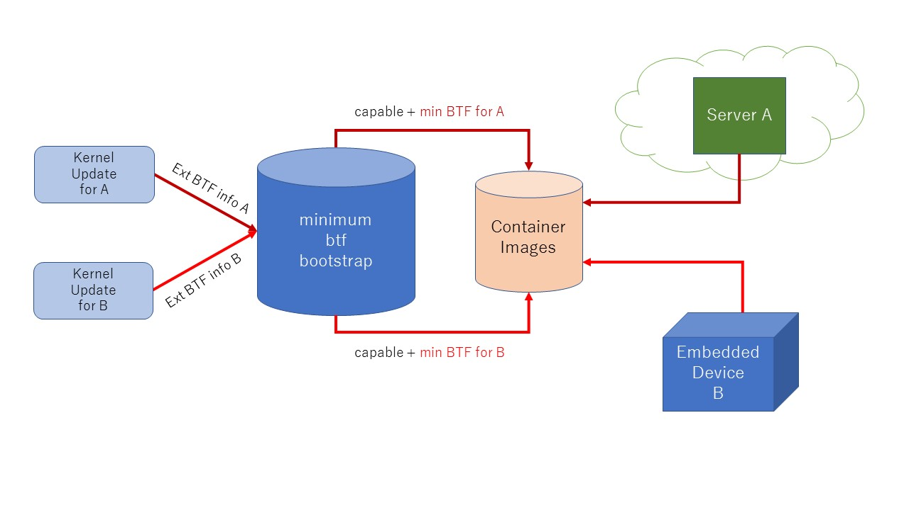

# Provide the minimum BTF-based tracer using BTFGen

## Introduction

- This is an experimental repository to test BTFGen to reduce the size of BTF information and provide for BTF on the environment without CONFIG_DEBUG_INFO_BTF.
- When the kernel is updated, we want to build the tool with the minimum BTF automatically.


## Build

- Prepare for the BTF encoded vmlinux or the external BTF.
- Put it into `btf_path`.
- Build the container image specifying it.
```
$ docker build -t minbtf_x86_64 -f Dockerfile.x86_64 ./ --build-arg btf_file="vmlinux.x86_64.btf"
```

## Run

- Run the container
```
$ sudo docker run --pid="host" --privileged -it -v /sys/kernel/debug:/sys/kernel/debug --rm minbtf_x86_64
```
